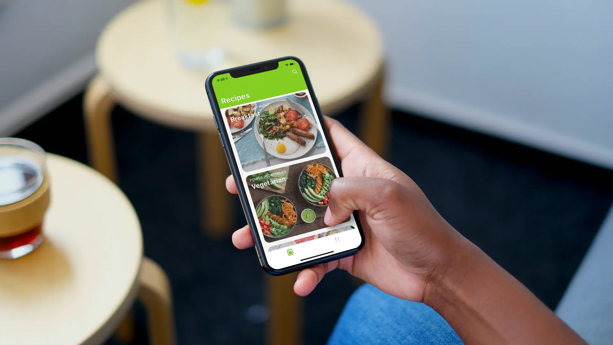
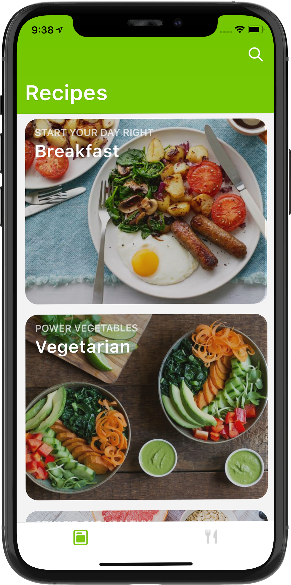
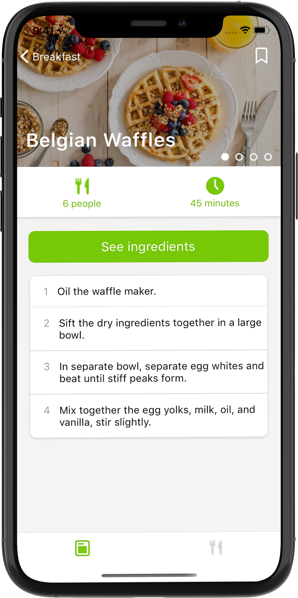
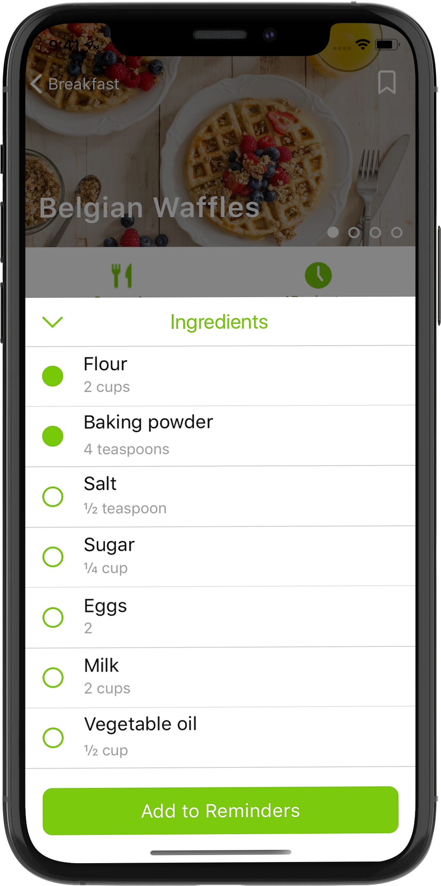
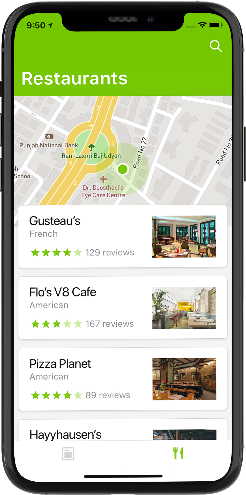
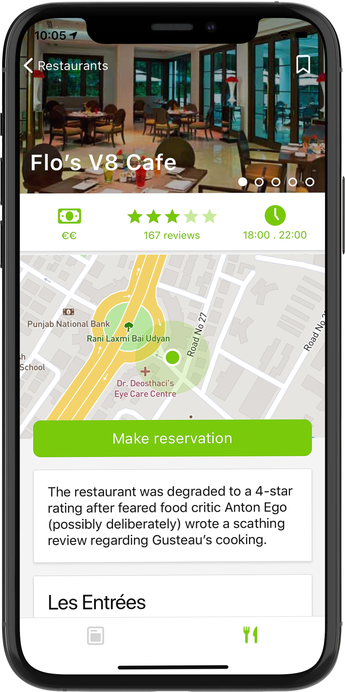
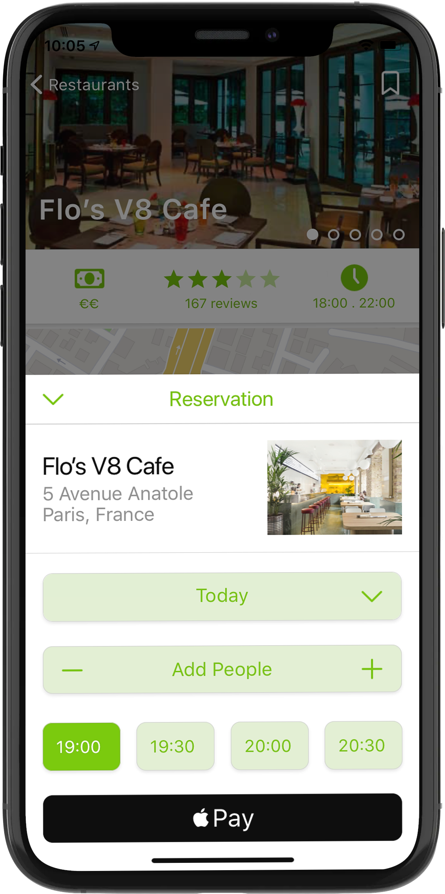
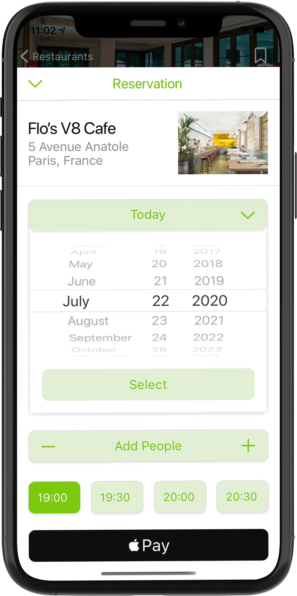

# React-Food-App

React-Food-App is a sample UI Design-Kit implementation build in React Native for both Android & iOS platform's.

 
## Share Your ❤️
  
 

## Recipes

| **** | **** | **** | **** | 
| :-----------: | :---------: | :----------: | :----------: |
|  |  |  |  | 
 

## Restaurants

| **** | **** | **** |**** |
| :-----------: | :---------: | :----------: | :----------: |
|  |   |  | |
 

## Author

### *Yuvraj Pandey*
*I am a passionate Engineer which likes to push himself on various fronts of technologies.*  

For more exciting updates follow me,

 &nbsp;&nbsp;&nbsp;&nbsp;&nbsp;&nbsp;&nbsp;&nbsp;&nbsp;&nbsp;&nbsp;&nbsp;&nbsp;&nbsp;&nbsp;&nbsp;&nbsp;&nbsp;&nbsp;&nbsp;&nbsp;&nbsp;&nbsp;&nbsp;&nbsp;&nbsp;&nbsp;&nbsp;&nbsp;&nbsp;&nbsp;&nbsp;&nbsp;&nbsp;&nbsp;&nbsp;
